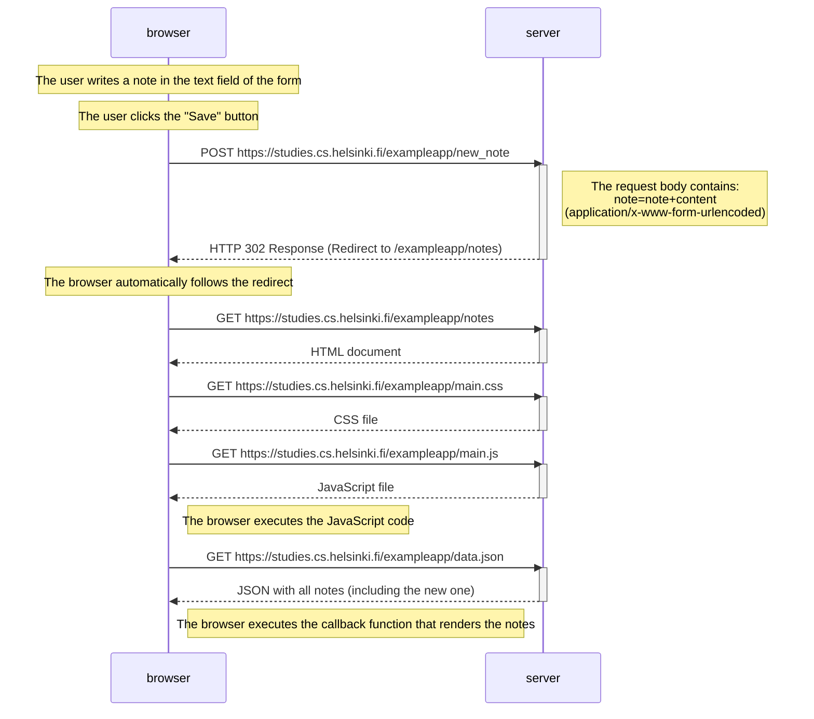

```mermaid
sequenceDiagram
    participant browser
    participant server

    Note over browser: The user writes a note in the text field of the form
    Note over browser: The user clicks the "Save" button

    browser->>server: POST https://studies.cs.helsinki.fi/exampleapp/new_note
    activate server
    Note right of server: The request body contains:<br>note=note+content<br>(application/x-www-form-urlencoded)
    server-->>browser: HTTP 302 Response (Redirect to /exampleapp/notes)
    deactivate server

    Note over browser: The browser automatically follows the redirect

    browser->>server: GET https://studies.cs.helsinki.fi/exampleapp/notes
    activate server
    server-->>browser: HTML document
    deactivate server

    browser->>server: GET https://studies.cs.helsinki.fi/exampleapp/main.css
    activate server
    server-->>browser: CSS file
    deactivate server

    browser->>server: GET https://studies.cs.helsinki.fi/exampleapp/main.js
    activate server
    server-->>browser: JavaScript file
    deactivate server

    Note right of browser: The browser executes the JavaScript code

    browser->>server: GET https://studies.cs.helsinki.fi/exampleapp/data.json
    activate server
    server-->>browser: JSON with all notes (including the new one)
    deactivate server

    Note right of browser: The browser executes the callback function that renders the notes
```