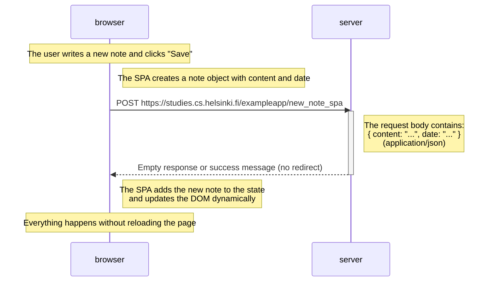

```mermaid
sequenceDiagram
    participant browser
    participant server

    Note over browser: The user writes a new note and clicks "Save"

    Note right of browser: The SPA creates a note object with content and date

    browser->>server: POST https://studies.cs.helsinki.fi/exampleapp/new_note_spa
    activate server
    Note right of server: The request body contains:<br>{ content: "...", date: "..." }<br>(application/json)
    server-->>browser: Empty response or success message (no redirect)
    deactivate server

    Note right of browser: The SPA adds the new note to the state<br>and updates the DOM dynamically

    Note over browser: Everything happens without reloading the page
```

